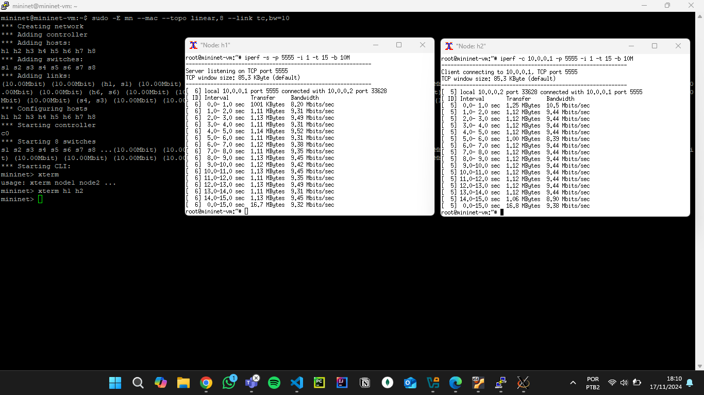

# Explanation of question 1

## Index

- [A. Creating topology](#a-creating-topology)
- [B. Checking informations of topology](#b-checking-informations-of-topology)
    - [Hosts configurantions](#hosts-configurantions)
    - [Dump of topology](#dump-of-topology)
    - [Net of topology](#net-of-topology)
    - [Nodes of topology](#nodes-of-topology)
- [C. Topology ilustration](#c-topology-ilustration)
- [D. Pings among different nodes](#d-pings-among-different-nodes)
- [E. Specifying host 1 as server and host 2 as client](#e-specifying-host-1-as-server-and-host-2-as-client)
    - [Configuration of putty](#configuration-of-putty)
    - [Login in mininet using puTTy](#login-in-mininet-using-putty)
    - [For 30 Mpbs](#for-30-mbps)
    - [For 1 Mpbs](#for-1-mbps)
    - [For 5 Mpbs](#for-5-mbps)
    - [For 10 Mpbs](#for-10-mbps)
    - [For 15 Mpbs](#for-15-mbps)
    - [For 20 Mpbs](#for-20-mbps)
    - [For 25 Mpbs](#for-25-mbps)

### A. Creating topology

---

### B. Checking informations of topology

#### Hosts configurantions

---

#### Dump of topology

---

#### Net of topology

---

#### Nodes of topology

---

### C. Topology ilustration

---

### D. Pings among different nodes

---

### E. Specifying host 1 as server and host 2 as client

#### Configuration of putty

---

#### Login in mininet using puTTy

---

#### For 30 Mbps

---

#### For 1 Mbps

---

#### For 5 Mbps

---

#### For 10 Mbps

---

#### For 15 Mbps

---

#### For 20 Mbps

---

#### For 25 Mbps

